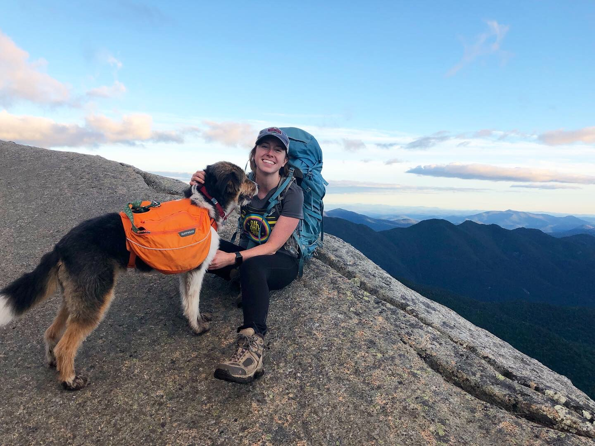

```{r setup, include=FALSE}
knitr::opts_chunk$set(echo = TRUE)
```


+ I study Entomology
+ I have run a marathon
+ I have an insect art RedBubble Store called [The Bug Ladies](https://www.redbubble.com/people/thebugladies)


